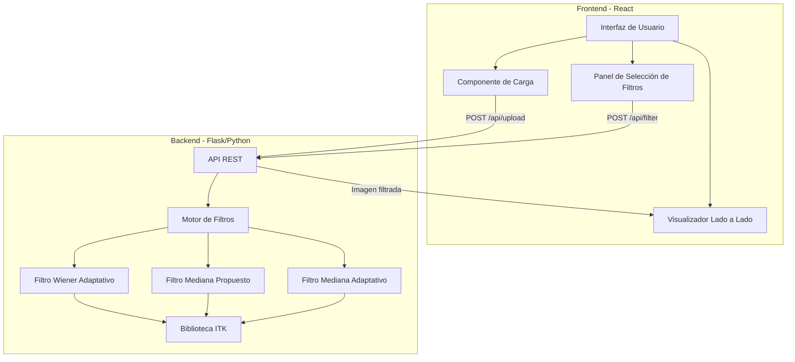
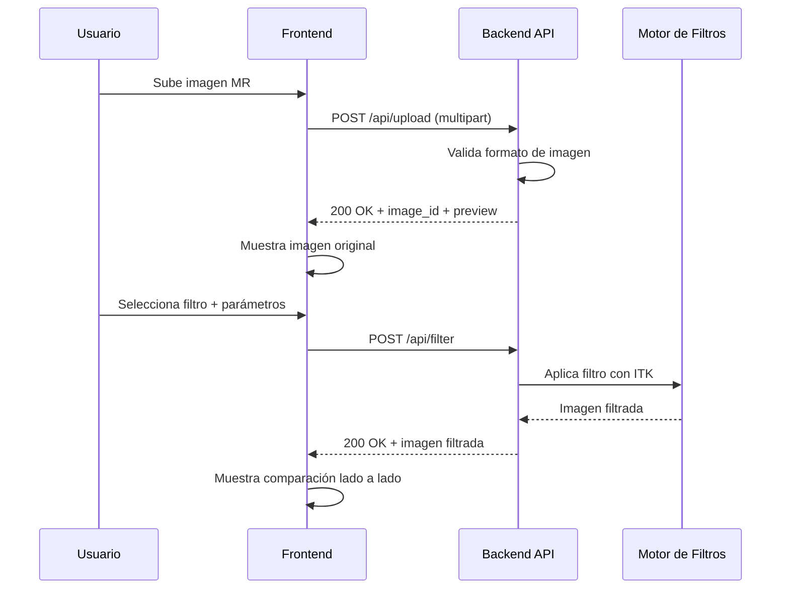

# Diseño: Filtros de Imágenes Médicas

## Visión General

Este sistema es una aplicación web para el procesamiento y evaluación de filtros de eliminación de ruido en imágenes de resonancia magnética (MR). La aplicación permite a investigadores médicos subir imágenes, aplicar tres tipos de filtros (Wiener Adaptativo, Mediana Propuesto y Mediana Adaptativo) y visualizar los resultados lado a lado con la imagen original.

La arquitectura sigue un modelo cliente-servidor con un frontend web que se comunica con un backend a través de una API REST. El backend utiliza la biblioteca ITK (Insight Toolkit) como motor de procesamiento de imágenes médicas.

### Decisiones de Diseño Clave

- **Python + Flask** para el backend: ITK tiene bindings maduros para Python (`itk`), lo que simplifica la integración.
- **React** para el frontend: Permite una interfaz reactiva para la visualización lado a lado.
- **API REST con transferencia de imágenes en base64/binario**: Simplicidad en la comunicación sin necesidad de almacenamiento persistente.
- **Procesamiento síncrono**: Las imágenes MR individuales son lo suficientemente pequeñas para procesarse en tiempo real sin colas de trabajo.

## Arquitectura



### Flujo de Datos



## Componentes e Interfaces

### Backend

#### API REST (Flask)

| Endpoint      | Método | Descripción         | Request                             | Response                    |
| ------------- | ------ | ------------------- | ----------------------------------- | --------------------------- |
| `/api/upload` | POST   | Sube una imagen MR  | `multipart/form-data` con archivo   | `{ image_id, preview_url }` |
| `/api/filter` | POST   | Aplica un filtro    | `{ image_id, filter_type, params }` | `{ filtered_image_url }`    |
| `/api/health` | GET    | Estado del servicio | -                                   | `{ status: "ok" }`          |

#### Motor de Filtros (`filter_engine.py`)

Clase principal que orquesta la aplicación de filtros usando ITK.

```python
class FilterEngine:
    def apply_filter(self, image_path: str, filter_type: str, params: dict) -> str:
        """Aplica el filtro especificado y retorna la ruta de la imagen resultante."""
        pass
```

#### Filtros Individuales

**Filtro Wiener Adaptativo** (`filters/wiener_adaptive.py`):

- Opera en el dominio de frecuencia
- Estima media local y desviación estándar en vecindad M×N
- Parámetros: `m` (filas vecindad), `n` (columnas vecindad)

**Filtro Mediana Propuesto** (`filters/proposal_median.py`):

- Opera en el dominio espacial
- Usa vecindad 8-conectada excluyendo el píxel central
- Sin parámetros configurables

**Filtro Mediana Adaptativo** (`filters/adaptive_median.py`):

- Opera en el dominio espacial
- Algoritmo de dos niveles con ventana dinámica
- Parámetros: `smax` (tamaño máximo de ventana)

### Frontend

#### Componentes React

| Componente       | Responsabilidad                                   |
| ---------------- | ------------------------------------------------- |
| `App`            | Layout principal y estado global                  |
| `ImageUploader`  | Carga de archivos con validación                  |
| `FilterSelector` | Selección de filtro y configuración de parámetros |
| `ImageViewer`    | Visualización lado a lado (original vs filtrada)  |

## Modelos de Datos

### Imagen Subida

```python
@dataclass
class UploadedImage:
    image_id: str          # UUID único
    filename: str          # Nombre original del archivo
    file_path: str         # Ruta en almacenamiento temporal
    format: str            # Formato detectado (DICOM, NIfTI, PNG, etc.)
    dimensions: tuple      # (ancho, alto)
    uploaded_at: datetime   # Timestamp de carga
```

### Solicitud de Filtrado

```python
@dataclass
class FilterRequest:
    image_id: str          # ID de la imagen a filtrar
    filter_type: str       # "wiener_adaptive" | "proposal_median" | "adaptive_median"
    params: dict           # Parámetros específicos del filtro
```

### Parámetros por Filtro

```python
# Wiener Adaptativo
WienerParams = {
    "m": int,  # Filas de la vecindad (default: 3)
    "n": int,  # Columnas de la vecindad (default: 3)
}

# Mediana Propuesto
ProposalMedianParams = {}  # Sin parámetros configurables

# Mediana Adaptativo
AdaptiveMedianParams = {
    "smax": int,  # Tamaño máximo de ventana (default: 7)
}
```

### Resultado de Filtrado

```python
@dataclass
class FilterResult:
    image_id: str              # ID de la imagen original
    filter_type: str           # Tipo de filtro aplicado
    filtered_image_path: str   # Ruta de la imagen filtrada
    processing_time_ms: float  # Tiempo de procesamiento
```

### Algoritmo del Filtro Mediana Adaptativo (Detalle)

```
Nivel A (Level 1):
  A1 = Zmed - Zmin
  A2 = Zmed - Zmax
  Si A1 > 0 AND A2 < 0 → ir a Nivel B
  Si no → incrementar tamaño de ventana
    Si tamaño <= Smax → repetir Nivel A
    Si no → salida = Zmed

Nivel B (Level 2):
  B1 = Zxy - Zmin
  B2 = Zxy - Zmax
  Si B1 > 0 AND B2 < 0 → salida = Zxy
  Si no → salida = Zmed

Donde:
  Zmin = valor mínimo en la ventana
  Zmax = valor máximo en la ventana
  Zmed = mediana en la ventana
  Zxy  = valor del píxel actual
```

## Propiedades de Corrección

_Una propiedad es una característica o comportamiento que debe mantenerse verdadero en todas las ejecuciones válidas de un sistema — esencialmente, una declaración formal sobre lo que el sistema debe hacer. Las propiedades sirven como puente entre especificaciones legibles por humanos y garantías de corrección verificables por máquinas._

### Propiedad 1: Aceptación de imágenes válidas

_Para toda_ imagen MR en formato válido (DICOM, NIfTI, PNG, JPEG), al subirla al endpoint de upload, el sistema debe retornar un código 200 con un `image_id` no vacío.

**Valida: Requisitos 1.1**

### Propiedad 2: Rechazo de archivos inválidos

_Para todo_ archivo que no sea una imagen válida (datos binarios aleatorios, archivos de texto, archivos corruptos), al subirlo al endpoint de upload, el sistema debe retornar un código de error HTTP (4xx) con un mensaje descriptivo.

**Valida: Requisitos 1.2**

### Propiedad 3: Preservación de dimensiones en todos los filtros

_Para toda_ imagen MR válida y _para todo_ filtro aplicado (Wiener Adaptativo, Mediana Propuesto, Mediana Adaptativo), la imagen filtrada resultante debe tener exactamente las mismas dimensiones (ancho × alto) que la imagen original.

**Valida: Requisitos 2.1, 3.1, 4.1, 5.3**

### Propiedad 4: Sensibilidad paramétrica del Filtro Wiener

_Para toda_ imagen MR válida y _para todo_ par de configuraciones de vecindad (M₁, N₁) ≠ (M₂, N₂), el resultado del Filtro Wiener Adaptativo con (M₁, N₁) debe ser diferente del resultado con (M₂, N₂) en al menos un píxel.

**Valida: Requisitos 2.3**

### Propiedad 5: Corrección del Filtro Mediana Propuesto

_Para toda_ imagen MR válida y _para todo_ píxel interior (no en el borde), el valor de salida del Filtro Mediana Propuesto debe ser igual a la mediana de los 8 píxeles vecinos (vecindad 8-conectada) excluyendo el valor del píxel central.

**Valida: Requisitos 3.1, 3.2**

### Propiedad 6: Corrección del algoritmo Mediana Adaptativo

_Para toda_ imagen MR válida y _para todo_ píxel, el valor de salida del Filtro Mediana Adaptativo debe cumplir: (a) si en algún tamaño de ventana ≤ Smax la mediana Zmed está estrictamente entre Zmin y Zmax, y el valor del píxel Zxy está estrictamente entre Zmin y Zmax, entonces la salida es Zxy; (b) si Zmed está entre Zmin y Zmax pero Zxy no, la salida es Zmed; (c) si ningún tamaño de ventana ≤ Smax produce una Zmed entre Zmin y Zmax, la salida es Zmed del tamaño Smax.

**Valida: Requisitos 4.1, 4.2, 4.3, 4.4**

### Propiedad 7: Respuesta válida de la API de filtrado

_Para toda_ solicitud de filtrado con un `image_id` válido y un `filter_type` válido, la respuesta HTTP debe tener código 200 y contener datos de imagen decodificables con las mismas dimensiones que la imagen original.

**Valida: Requisitos 2.4, 3.3, 6.3**

### Propiedad 8: Preservación de metadatos (round-trip)

_Para toda_ imagen MR con metadatos (DICOM o NIfTI), al aplicar cualquier filtro, los metadatos de la imagen resultante deben ser idénticos a los metadatos de la imagen original.

**Valida: Requisitos 7.2**

### Propiedad 9: Manejo de errores en procesamiento

_Para toda_ solicitud de filtrado con datos inválidos (imagen corrupta, parámetros fuera de rango, filter_type inexistente), el sistema debe retornar un código de error HTTP (4xx/5xx) con un mensaje de error descriptivo, sin causar un crash del servidor.

**Valida: Requisitos 1.2, 7.3**

## Manejo de Errores

| Escenario                                  | Código HTTP | Respuesta                                                    |
| ------------------------------------------ | ----------- | ------------------------------------------------------------ |
| Archivo no es imagen válida                | 400         | `{ "error": "Formato de archivo no soportado" }`             |
| `image_id` no encontrado                   | 404         | `{ "error": "Imagen no encontrada" }`                        |
| `filter_type` inválido                     | 400         | `{ "error": "Tipo de filtro no válido" }`                    |
| Parámetros fuera de rango (M, N, Smax ≤ 0) | 400         | `{ "error": "Parámetros inválidos: ..." }`                   |
| Error interno de ITK                       | 500         | `{ "error": "Error en el procesamiento de imagen" }`         |
| Imagen demasiado grande                    | 413         | `{ "error": "La imagen excede el tamaño máximo permitido" }` |

### Estrategia de Manejo

- Todas las excepciones de ITK se capturan en el `FilterEngine` y se traducen a respuestas HTTP apropiadas.
- Los errores de validación de entrada se verifican antes de invocar el motor de filtros.
- El backend usa logging estructurado para registrar errores con contexto (image_id, filter_type, stack trace).
- Los errores del frontend se muestran al usuario con mensajes amigables, sin exponer detalles técnicos.

## Estrategia de Testing

### Testing Unitario

Los tests unitarios cubren casos específicos y condiciones de borde:

- **Validación de upload**: Verificar aceptación de formatos válidos (DICOM, NIfTI, PNG) y rechazo de inválidos.
- **Filtro Wiener**: Verificar con imagen conocida que el resultado coincide con el cálculo manual.
- **Filtro Mediana Propuesto**: Verificar con matriz 3×3 conocida que el píxel central se reemplaza por la mediana de los 8 vecinos.
- **Filtro Mediana Adaptativo**: Verificar el comportamiento del Nivel 1 y Nivel 2 con ventanas construidas manualmente. Verificar el caso borde cuando se alcanza Smax.
- **API endpoints**: Verificar códigos de respuesta HTTP para cada escenario de error.
- **Manejo de bordes de imagen**: Verificar el comportamiento correcto en píxeles de borde y esquina.

### Testing Basado en Propiedades

Se utilizará la biblioteca **Hypothesis** (Python) para implementar tests basados en propiedades.

Cada test de propiedad debe:

- Ejecutar un mínimo de **100 iteraciones**
- Referenciar la propiedad del documento de diseño con un comentario
- Formato de etiqueta: **Feature: medical-image-filters, Property {número}: {texto de la propiedad}**

Los tests basados en propiedades implementarán las 9 propiedades definidas en la sección de Propiedades de Corrección, generando imágenes aleatorias de diferentes tamaños y valores de píxel, parámetros aleatorios dentro de rangos válidos, y archivos inválidos aleatorios para verificar el rechazo.

### Complementariedad

- Los **tests unitarios** verifican ejemplos concretos, casos borde y condiciones de error específicas.
- Los **tests de propiedades** verifican que las propiedades universales se mantienen para todas las entradas válidas generadas aleatoriamente.
- Juntos proporcionan cobertura completa: los tests unitarios detectan bugs concretos, los tests de propiedades verifican la corrección general.
